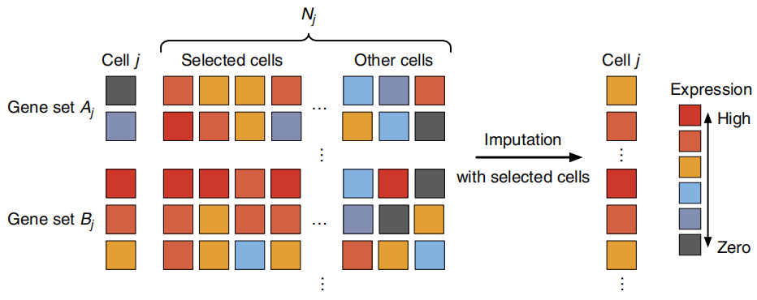

# scImpute
### By Hanxiang Xu, Kazune Fei, Yanpei Wang

---

## Background and Motivation

Single-cell RNA (scRNA-seq) technologies are now emerging as a powerful tool to capture transcriptoe-wide cell-to-cell variability. ScRNA-seq enables the qunatification of intro-population  heterogeneity at a much higher resolution, potentially revealing dynamics in heterogeneous cell populations and complex tissues. 

One important characteristic of scRNA-seq data is the 'dropout' phenomenon, where a gene is observed at a moderate expression level in one cell but undetected in another cell. The frequency of dropouts is protocol dependent, for instance, droplet-based microfluidics protolcols tend to have a much higher dropout rate compared to the Fluidigm C1 platform. Since this characteristic is dependent on protocol and the accuracy of downstream scRNA-seq analyses-such as differential gene expression analysis, cell-type identification, and recontruction of differential trajectories-relies heavily on accurate gene expression measurements, it is crucial for the statistical or computational methods developed for scRNA-seq to take the dropout issue into condisderation and correct these false zero expression values

Existing imputation methods, such as **MAGIC** and **SAVER**, attempt to adddress this problem but have a significant limitation: they alter all gene expression levels, including those unaffected by dropouts. This could potentially introduce new biases into the data and eliminate meaningful biological variation. The scImpute method is proposed to overcome these limitaitons by simultaneously determining which values are affected by dropout events and performing imputation only on those highly probable dropout entries.  

## Introduction of scImpute

scImpute is a two-stage statistical method built on the philosophy of targeted imputation and cell similarity. 

**Figure 1. Overview of the scImpute method** scImpute firstly learns each gene's dropout probability in each cell by fitting a mixture model. Next, scImpute imputes the highly probable dropout values in cell $j$ (gene set $A_j$) by borrowing information of the same gene in other similar cells, which are selected based on gene set $B_j$ (not severely affected by dropout events)

