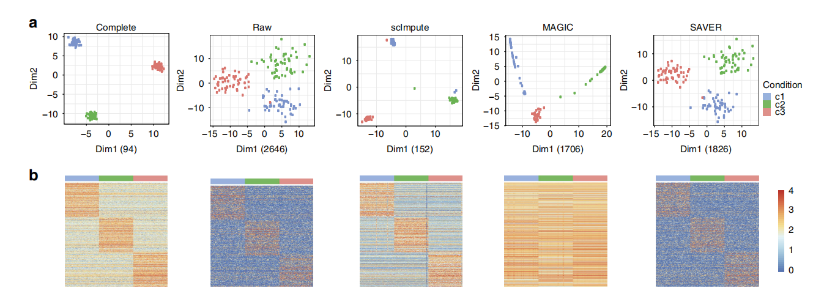

# Using scImpute for Robust Single Cell RNAseq Imputation
### By Hanxiang Xu, Kazune Fei, Yanpei Wang

---

## Background and Motivation

Single-cell RNA (scRNA-seq) technologies are now emerging as a powerful tool to capture transcriptome-wide cell-to-cell variability. ScRNA-seq enables the qunatification of intro-population heterogeneity at a much higher resolution, potentially revealing dynamics in heterogeneous cell populations and complex tissues. 

One important characteristic of scRNA-seq data is the 'dropout' phenomenon, where a gene is observed at a moderate expression level in one cell but undetected in another cell. The frequency of dropouts is protocol dependent, for instance, droplet-based microfluidics protolcols tend to have a much higher dropout rate compared to the Fluidigm C1 platform. Since this characteristic is dependent on protocol and the accuracy of downstream scRNA-seq analyses-such as differential gene expression analysis, cell-type identification, and recontruction of differential trajectories-relies heavily on accurate gene expression measurements, it is crucial for the statistical or computational methods developed for scRNA-seq to take the dropout issue into condisderation and correct these false zero expression values

Existing imputation methods, such as **MAGIC** and **SAVER**, attempt to adddress this problem but have a significant limitation: they alter all gene expression levels, including those unaffected by dropouts. This could potentially introduce new biases into the data and eliminate meaningful biological variation. The scImpute method is proposed to overcome these limitaitons by simultaneously determining which values are affected by dropout events and performing imputation only on those highly probable dropout entries. This approach ensures that techinical variation resulting from scRNA-seq is reduced, while the biological variation in cells is better preserved, thereby avoiding excess bias. 

## Introduction of scImpute

scImpute is a two-stage statistical method built on the philosophy of targeted imputation and cell similarity. 

**Figure 1. Overview of the scImpute method** scImpute firstly learns each gene's dropout probability in each cell by fitting a mixture model. Next, scImpute imputes the highly probable dropout values in cell $j$ (gene set $A_j$) by borrowing information of the same gene in other similar cells, which are selected based on gene set $B_j$ (not severely affected by dropout events)

### Identification of Likely Dropouts

scImpute models the expression of each gene within a cell subpopulation using a mixture model composed of two components. The first component is a Gamma distribution used to account for the dropouts, while the second component is a Normal distribution to represent the actual gene expression levels. For each gene $i$, its expression in cell subpopulation $k$ is modeled as a random variable $X_i^{(k)}$ with density function: 

$$
f\_{X\_i}^{(k)}(x)=\lambda\_i^{(k)}\mathrm{Gamma}(x;\alpha\_i^{(k)},\beta\_i^{(k)})+(1-\lambda\_i^{(k)})\mathrm{Normal}(x;\mu\_i^{(k)},\sigma\_i^{(k)})
$$

where $\lambda\_i^{(k)}$ is gene $i$'s dropout rate in cell subpopulation $k$, $\alpha_i^{(k)}$, $\beta_i^{(k)}$ are the shape and rate parameters of Gamma distribution, and $\mu_i^{(k)}$, $\alpha_i^{(k)}$ are the mean and standard deviation of Normal distribution. The intuition behind this mixture model is that if a gene has high expression and low vairation in most cells within a cell subpopulation, a zero count is more likely to be a dropout value; on the other hand, if a gene has constantly low or medium expression with high variation, then a zero count may reflect real biological variability. The parameters in mixture model are estimated by the Expectation-Maximization (EM) algorithm, and we denote their estimate as $\hat{\lambda_i^{(k)}}$, $\hat{\alpha_i^{(k)}}$, $\hat{\beta_i^{(k)}}$, $\hat{\mu_i^{(k)}}$ and $\hat{\sigma_i^{(k)}}$. It follows that the dropout probablity of gene $i$ in cell $j$, which belongs to subpopulation $k$, can be estimated as 

$$
d\_{ij}=\frac{\hat{\lambda}\_i^{(k)}\mathrm{Gamma}(x;\hat{\alpha}\_i^{(k)},\hat{\beta}\_i^{(k)})}{\hat{\lambda}\_i^{(k)}\mathrm{Gamma}(x;\hat{\alpha}\_i^{(k)},\hat{\beta}\_i^{(k)})+(1-\hat{\lambda}\_i^{(k)})\mathrm{Normal}(x;\hat{\mu\_i}^{(k)},\hat{\sigma\_i}^{(k)})}
$$

Therefore, each gene $i$ has an overall dropout rate $\hat{\lambda}\_i^{(k)}$ that is shared by all cells in subpopulation $k$. Gene $i$ also has dropout probabilities $d_{ij}(j=1,2,...,J)$, which may differ across cells. 

### Learning Cell Similarity

For each cell $j$, select a gene set $A_j$ in need of imputation based on genes' dropout probabilities in cell $j$: $A_j= \lbrace i:d_{ij} \ge t \rbrace$, where $t$ is a threshold on dropout probabilities. There is also a gene set $B_j=\lbrace i:d_{ij}<t \rbrace$ which have accurate gene expression with high confidence and do not need imputation. We learn cells' similarities through the gene set $B_j$, and use the non-negative least squares (NNLS) regression:

$$
\hat{ \beta } ^{(j)}=\text{argmin}_{\beta^{(j)}} \lVert X_{B_j,i}-X_{B_j,N_j}\beta^{(j)} \rVert^2_2
$$

$$
\text{subject \ to \ } \beta^{(j)} \ge 0
$$

$N_j$ represents the indices of cells that are candidate neighbors of cell $j$. The response $X_{B_j,j}$ is a vector representing the $B_j$ rows in the $j$-th column of $X$, the design matrix $X_{B_j,N_j}$ is a sub-matrix of $X$ with dimensions $\| B_j \| \times \|N_j\|$, and the coefficients $\beta^{(j)}$ is a vector of length $\| N\_j \|$. 

$\hat{ \beta } ^{(j)}$ represents the weighted contribution of each similar neighbor cell to the expression profile of cell $j$. NNLS has the property of leadning to sparse estimated coefficient vector $\hat{ \beta^{(j)} }$ whose components may have exact zeros, so NNLS can be used to select similar cells of cell $j$ from its neighbors $N_j$. 

### Imputation of Dropout Values

The estimated coefficients $\hat{\beta^{(j)}}$ from the set $B_j$ are used to impute the expression of genes in the set $A_j$ in cell $j$:

$$
\hat{X}_{ij} =
\begin{cases}
X_{ij}, & i \in B_j \quad \text{(Value retained as it is accurate/true)} \\
X_{i, N_j}\,\hat{\beta}^{(j)}, & i \in A_j \quad \text{(Value imputed using neighbor cells' weighted contributions)}
\end{cases}
$$

## Results

### scImpute recovers gene expression affected by dropouts

#### scImpute recovers the true expression of the ERCC spike-in transcripts

The ERCC spike-ins are synthetic RNA molecules with known concentrations which serve as gold standards of true expression levels, so that the read counts can be compared with the ture expression for accuracy evaluation. The dataset contains 3005 cells from the mouse somatosensory cortex region. Figure 2 shows that after imputation, the median correlation (of the 3005 cells) between 57 transcripts' read counts and their true concentrations increases from 0.92 to 0.95, and the minimum correlation increases from 0.81 to 0.89. 

**Figure 2. Correlation between ERCC spike-ins' counts and their true concentration**. The	two	distributions	show	the	correlations between	the	ERCC	spike-ins'	log10(count+1)	and	log	10(concentration)	in	the	3005	mouse	cortex	cells	(one	correlation	per	cell	for	raw	counts	or	counts	corrected	by	scImpute).

Figure 3 further shows that the read counts and true concentrations also present a stronger linear relationship in every single cell.

**Figure 3. scImpute improves the dropouts in the ERCC RNA scripts** The y-axis and x-axis give the ERCC spike-ins’ log10(count+1) and log10
(concentration) in four randomly selected mouse cortex cells. The imputed data present stronger linear relationships between the true concentrations and the observed counts

### scImpute correctly imputes the dropout values of 892 annotated cell cycle genes in 182 embryonic stem cells (ESCs) that had been staged for cell cycle phases (G1, G2M and S)

These genes are know to modulate the cell cycle and are expected to have non-zero expression during different stages of the cell cycle. Before imputation, 22.5% raw counts of the cell cycle genes are zeros, which are highly likely due to dropouts. The data are normalized by sequencing depths instead of ERCC spike-ins. After imputations, most of the dropout values are corrected, and true dynamics of these genes in the cell cycle are recovered (Figs 4 and 5）.

 

**Figure 4 Heatmaps	showing	the	log10(count+1)	of	the	892	cell	cycle	genes	before	and	after	imputation.** . Rows	correspond	to	genes,	and	columns	correspond	to	cells.

 

**Fig. 5 Expression	of	cell	cycle	genes	before	and	after	imputation.** Violin	plots	showing	the	log10(count+1)	of	the	892	cell	cycle	genes	in	the	three	phases	(G1,	G2M,	and	S).	This	comparison	result	shows	that scImpute	has	successfully	imputed the	dropout	expression	values	of	cell	cycle	genes.

Figure 6 shows that imputed counts also represent the true biological variation in these cell cycles genes. 

 

**Fig. 6 Violin plots showing the log10(count+1) of nine cell cycle genes** The expression levels of these genes belong to three phases (G1, G2M, and S). scImpute has corrected the dropout values of cell cycle genes. 

### Use Simulation Study to test the efficacy of scImpute in enhancing the identification of cell types

We simulate expression data of three cell types $c_1 \, c_2$ and $c_3$, each with 50 cells, and 810 among 20000 genes are truly differentially expressed. Even though the three cell types are clearly distinguishable when we apply principal component analysis (PCA) to the complete data, this separation become less apparent in the raw data with dropout events. Specifically, the within-cluster sum-of-squares calculated based on the first two principal components (PCs) increases from 94 in the complete data to 2646 in the raw data. After applying scImpute, however, the relationships among the 150 cells become much clearer. The other two methods MAGIC and SAVER are also able to distinguish the three cell types, but MAGIC tends to introduce artificial signals that substantially alter the data and thus the PCA result, whereas SAVER provides only a modest improvement compared with the clustering result over that of the raw data (Fig7). Moreover, the dropout events obscure the differential pattern and make it harder to detect DE genes. In contrast, the imputed data by scImpute lead to a clearer contrast between the upregulated genes in different cell types, while the imputed data by MAGIC and SAVER fail to recover these underlying patterns (Fig7). 

 

**Fig. 7 scImpute corrects dropout values and helps define cellular identity in the simulated data.**   
**a** The first two PCs calculated from the complete data, the raw data, and the imputed data by scImpute, MAGIC, and SAVER. Numbers in the parentheses are the within-cluster sum of squares calculated based on the first two PCs. The within-cluster sum of squares is defined as $\sum\_{k=1}^{3} \sum\_{j=1}^{50} \lVert {y}\_{kj} - \bar{y}\_{k} \rVert ^2$, where $\bar{y}\_{k} = \frac{1}{50} \sum\_{j=1}$, and $y\_{kj}$ is a vector of length 2, denoting the first two PCs of cell $j$ in cell type $c\_k$. **b** The expression profiles of the 810 true DE genes in the complete, raw, and imputed datasets.

We also investigate the impact of dropout prevalence on scImpute's performance. As anticipated, the accuracy of differential expression analysis improves as the dropout rate declines. However, scImpute delivers >80% area under the precision-recall curve (AUPRC) even when zero counts reach 75% of the dataset (Fig. 8). 

**Fig. 8 Performance	of	scImpute	given	different	dropout	rates	in	raw	simulated	data.** **a**:	The	theoretical	dropout	rates	determined	by	the	double	exponential	function $exp(−\rho \times log\_{10} (\text{count}+1)^2)$,	with $\rho$ varying from 0.01 to 0.19	by a step size of	0.02.	**b-d**: The	precision-recall curves	for	the	identification of differentially expressed genes from	the	imputed	data.

## Discussion 

The key novelty of scImpute lies in its selective imputation approach. It focuses only on imputing the missing expression values of genes likely afffected by dropouts, while retaining the expression levels of genes that are largely unaffceted. Hence, it can reduce technical variation resulted from scRNA-seq and better represent cell-to-cell biological variation, while it also avoids introducing excess biases. 

An attractive advantage of scImpute is that it can be incorporated into most existing pipelines or downstream analysis of scRNA-seq data, such as normalization, differential expression analysis, clustering and classification. scImpute can improve the data quality through an imputation perspective, meaning its applicability is not restricted to a specific task. It takes the raw count matrix as input and outputs as an imputed count matrix of the same dimensions, allowing it to be seamlessly combined with other computational tools without reformatting. 

scImpute is easy to use as it only invloves two parameters that are easily understood and selected. The first parameter $K$ denotes the potential number of cell populations, it is selected based on the clustering outcome of the raw data and the resolution desired by the researcher. Selecting a small $K$ allows scImpute to borrow more information across cells, while a large $K$ leads to a more cautious imputation process. The second parameter $t$ acts as a cutoff for dropout probabilities. The method is robust to variations in this parameter, and a default setting of 0.5 is often adequate for most scRNA-seq datasets. 

scImpute demonstrates good scalability as the number of cells increases. Its computational performance can be significantly enhanced by performing an initial filtering step on cells based on biological knowledge. A future direction is to improve imputation efficiency when dropout rates are severely high, typical of droplet-based technologies.  

# Reference

Li, W.V., Li, J.J. An accurate and robust imputation method scImpute for single-cell RNA-seq data. Nat Commun 9, 997 (2018). https://doi.org/10.1038/s41467-018-03405-7

